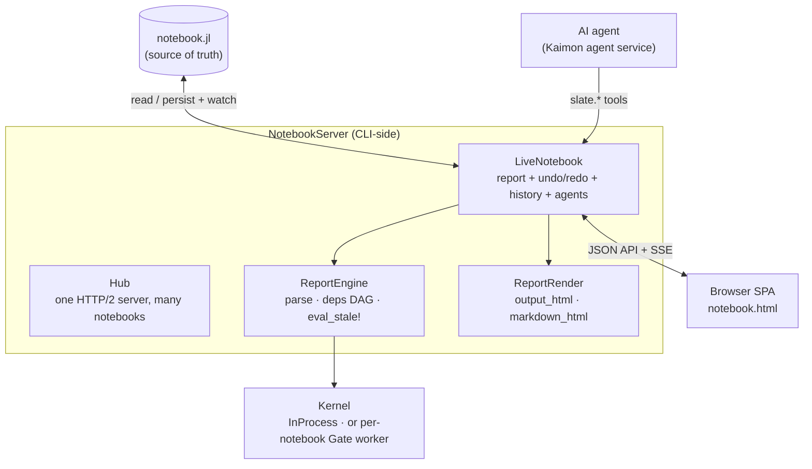

# Architecture

KaimonSlate is layered. The source of truth is a plain `.jl` file; everything else is built
around keeping a reactive in-memory model, a browser view, and an evaluation kernel in sync
with it.

## Source of truth: the `.jl` file

A notebook is a `.jl` file with `#%%` cell headers (`#%% code id=…`, `#%% md id=…`). The
server parses it into a `Report` of `Cell`s. Every in-app mutation **persists back** to the
file, and a file-watcher pulls in **external** edits (VS Code, the agent writing directly,
git). Because the file is canonical, the browser, your editor, and the agent never drift.

## ReportEngine — reactivity

`ReportEngine` parses cells, analyzes each cell's **reads** and **writes**, and builds a
dependency DAG. `eval_stale!` recomputes only the cells marked stale, in topological order.
Editing a cell marks it and its transitive dependents stale; changing a bound widget restales
the readers of that variable. Async cells can call `slate_refresh(:x)` to restale readers of
`x` and push a live update. See [Reactive Cells](reactivity.md).

## Kernels — where cells evaluate

| Kernel | When | Notes |
| --- | --- | --- |
| `InProcessKernel` | Standalone notebook not inside a project | Cells eval in the server process. No separate log; no package management. |
| `GateKernel` | Inside a Julia project with Kaimon's gate available | Each notebook gets its **own worker process**: clean namespace, tailable log, [package management](packages.md), isolation. |

The gate worker exposes a small set of internal tools (`__slate_eval`, `__slate_set_bind`,
`__slate_project_deps`, `__slate_pkg`, …) that the engine calls over the gate. The notebook
namespace contract is shared between in-process and worker kernels so `@bind` and friends
behave identically.

## NotebookServer — the hub

One HTTP/2 server hosts many notebooks. Routes are notebook-scoped (`/n/<id>` for the SPA,
`/api/<id>/…` for JSON, `/api/<id>/events` for the SSE stream). The browser holds a long-lived
`EventSource`; structural changes bump a version and trigger a full re-render, while value-only
updates patch outputs in place (preserving editor state and scroll).

## ReportRender — output

`output_html` renders a code cell's captured value, stdout, errors, and rich display chunks
(images as base64, HTML, LaTeX). `markdown_html` renders markdown cells with GFM tables,
KaTeX math, and `{{ … }}` interpolation. Interactive ECharts and tables are hydrated
client-side from per-cell specs. The same rendering powers [HTML/PDF export](export.md).

## The AI agent

When running under Kaimon, the agent is a **consumer** of the same surface: it drives the
notebook through the `slate.*` tools (which call the agent cell ops), and its event stream is
relayed onto the notebook's SSE so the chat pane updates live. A build-floor + version-CAS
layer lets several agents drive one notebook safely. See [The AI Agent](agent.md).
